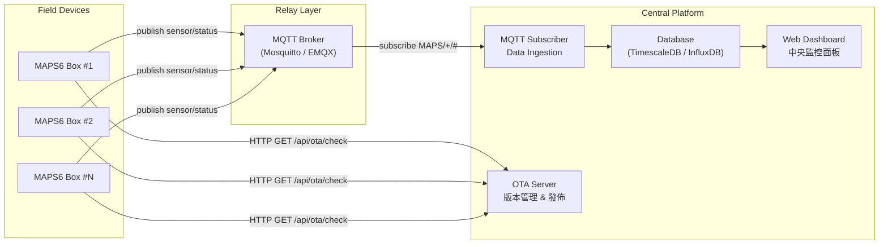
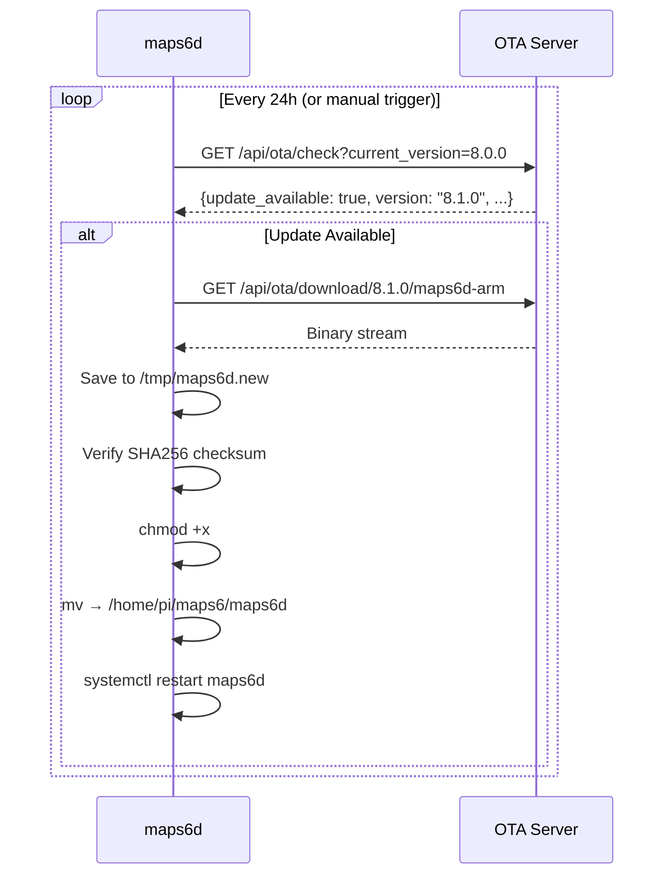
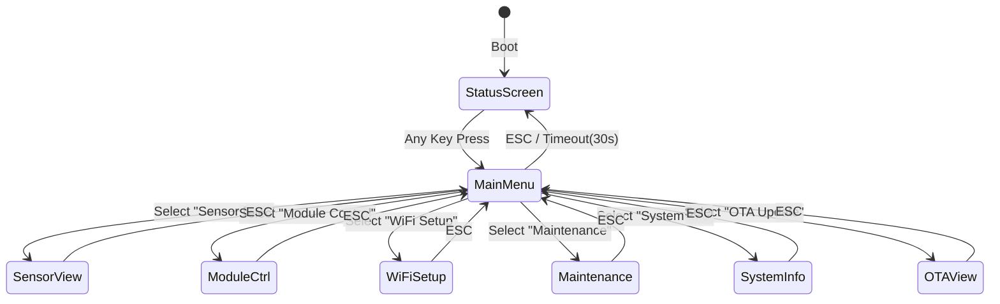
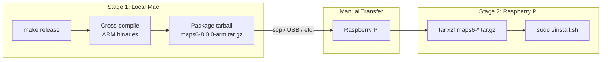
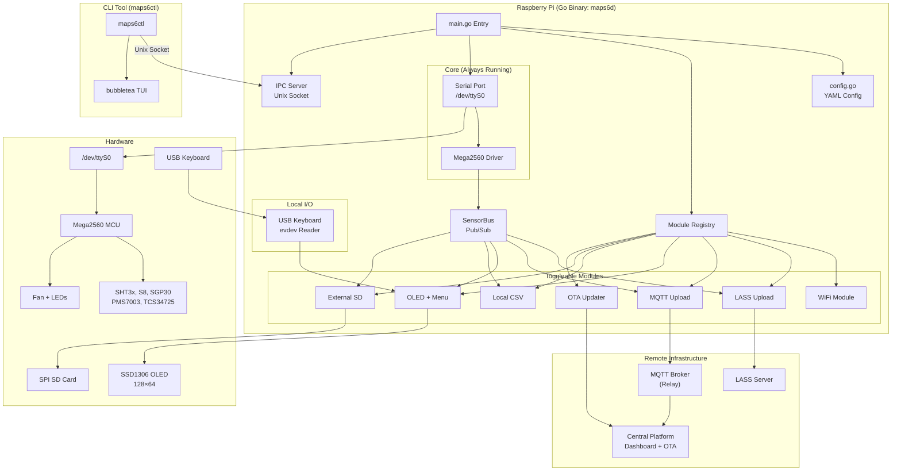

# MAPS 8.0 Go 語言重構實作計劃 (v2)

## 目標概述

將 MAPS 空氣品質監測盒子從 Python + Docker 完全重寫為 **Go 原生二進位**。
新系統以 systemd 服務直接運行，採模組化架構，支援本機 OLED 鍵盤選單、
遠端 SSH CLI 管理、雙通道上傳 (LASS HTTP + 自建 MQTT)、OTA 自動更新。

### 核心變革

| 面向 | 現行 (Python + Docker) | 新版 (Go v8.0.0) |
| :--- | :--- | :--- |
| 執行環境 | Docker 容器 (~190MB image) | 單一 ARM 二進位 (~10-15MB) |
| 服務管理 | `docker run --privileged` | `systemctl start maps6d` |
| 模組控制 | 硬編碼全開 | 獨立模組即時開關，Config 持久化 |
| 管理介面 | Flask Web Dashboard (Port 5000) | CLI 工具 `maps6ctl` + OLED 鍵盤選單 |
| 上傳通道 | WiFi HTTP 或 NB-IoT MQTT (耦合) | 獨立 LASS HTTP + 自建 MQTT (可各自開關) |
| 中央監控 | 無 | MQTT 訂閱 → Central Dashboard |
| 更新機制 | 手動替換 Docker tar | OTA 自動版本檢查與更新 |
| LTE/GPS | 部分實作 | **不實作，保留介面** 供未來擴充 |

---

## User Review Required

> [!IMPORTANT]
> **Web Dashboard 完全移除**：Flask Web Dashboard 將被移除。即時監控改由：
> 1. 本機：OLED 螢幕 + USB 鍵盤選單
> 2. 遠端：`ssh pi@box` → `maps6ctl tui` 終端面板
> 3. 集中：Central Platform Dashboard（MQTT 訂閱所有盒子）

> [!IMPORTANT]
> **CLI 工具取代內嵌 SSH**：不再在 Go 程式中內嵌 SSH 伺服器。改為：
> - 保留樹莓派系統原生 `sshd`
> - 提供 `maps6ctl` CLI 工具（透過 Unix socket 與 daemon 通訊）
> - 使用者 SSH 登入後執行 `maps6ctl tui` 進入互動面板

> [!IMPORTANT]
> **LTE/GPS 暫不實作**：SIM7000E 相關模組（`internal/modem/`）本次不實作。
> Module 介面保留擴充點，未來加入 LTE 模組只需實作 `Module` interface 並註冊。

---

## MQTT 三層架構與協定規範

### 架構圖



### MQTT Topic 結構

| Topic | 方向 | 說明 | QoS |
| :--- | :--- | :--- | :--- |
| `MAPS/{DEVICE_ID}/sensor` | Box → Broker | 感測器數據 (每 5 分鐘) | 1 |
| `MAPS/{DEVICE_ID}/status` | Box → Broker | 系統狀態 (每 10 分鐘) | 1 |
| `MAPS/{DEVICE_ID}/command` | Broker → Box | 遠端控制指令 (保留) | 1 |

### Sensor Payload (JSON)

```json
{
  "device_id": "B827EB52FDBC",
  "app": "MAPS6",
  "version": "8.0.0",
  "timestamp": "2026-07-30T06:55:00Z",
  "sensor": {
    "temp": 25.50,
    "humi": 60.00,
    "co2": 450,
    "ave_co2": 448,
    "tvoc": 120,
    "eco2": 440,
    "illuminance": 350,
    "color_temp": 5500,
    "pm1_ae": 8,
    "pm25_ae": 15,
    "pm10_ae": 22,
    "pm1_sp": 7,
    "pm25_sp": 14,
    "pm10_sp": 20
  },
  "gps": {
    "lat": 0,
    "lon": 0,
    "source": "static"
  }
}
```

### Status Payload (JSON)

```json
{
  "device_id": "B827EB52FDBC",
  "app": "MAPS6",
  "version": "8.0.0",
  "timestamp": "2026-07-30T06:55:00Z",
  "uptime_sec": 309720,
  "mcu_firmware": 980,
  "network": {
    "state": "wifi",
    "ip": "192.168.1.100",
    "ssid": "Lab-WiFi"
  },
  "modules": {
    "wifi": true,
    "lass": true,
    "mqtt": true,
    "oled": true,
    "storage_local": true,
    "storage_ext": true,
    "ota": true
  },
  "mcu_errors": {
    "sensor_timeout": 0,
    "checksum_fail": 2
  }
}
```

---

## OTA REST API 規格

OTA 伺服器為 Central Platform 的一部分，提供以下 HTTP REST API：

### 版本檢查

```
GET /api/ota/check?device_id={id}&current_version={ver}&app=MAPS6

Response 200 (有更新):
{
  "update_available": true,
  "latest_version": "8.1.0",
  "download_url": "/api/ota/download/8.1.0/maps6d-arm",
  "checksum_sha256": "a1b2c3d4e5f6...",
  "size_bytes": 12345678,
  "release_notes": "Fix sensor polling timeout",
  "mandatory": false,
  "min_version": "7.0.0"
}

Response 200 (無更新):
{
  "update_available": false,
  "latest_version": "8.0.0"
}
```

### 二進位下載

```
GET /api/ota/download/{version}/maps6d-arm

Response 200: binary octet-stream
Headers:
  Content-Type: application/octet-stream
  X-Checksum-SHA256: a1b2c3d4e5f6...
  Content-Length: 12345678
```

### OTA 更新流程 (Box 端)



---

## 專案結構

```
new_system/
├── cmd/
│   ├── maps6d/
│   │   └── main.go                  # 守護程序入口
│   └── maps6ctl/
│       └── main.go                  # CLI 控制工具入口
├── internal/
│   ├── config/
│   │   ├── config.go                # YAML 設定結構 & 載入
│   │   └── defaults.go              # 預設值常數
│   ├── serial/
│   │   └── port.go                  # 串口管理 (mutex 保護)
│   ├── mcu/
│   │   ├── protocol.go              # 封包格式、Checksum、指令常數
│   │   ├── mega2560.go              # MCU 指令介面
│   │   └── sensor.go                # SensorData 結構體
│   ├── module/
│   │   ├── module.go                # Module 介面定義
│   │   └── registry.go              # 模組生命週期管理
│   ├── network/
│   │   ├── manager.go               # 連線狀態偵測
│   │   └── wifi.go                  # WiFi 掃描 & 設定
│   ├── upload/
│   │   ├── lass.go                  # LASS REST HTTP 上傳
│   │   └── mqtt.go                  # 自建 MQTT Publish
│   ├── storage/
│   │   ├── local.go                 # 本機 CSV 儲存
│   │   └── external.go              # 擴充板 SPI SD 卡
│   ├── display/
│   │   ├── oled.go                  # SSD1306 OLED 渲染
│   │   └── menu.go                  # OLED 鍵盤選單狀態機
│   ├── input/
│   │   └── keyboard.go              # USB 鍵盤 evdev 讀取
│   ├── tui/
│   │   ├── app.go                   # bubbletea TUI (maps6ctl 用)
│   │   └── views.go                 # 狀態/選單頁面
│   ├── ipc/
│   │   ├── server.go                # Unix socket IPC 伺服器 (daemon 端)
│   │   ├── client.go                # Unix socket IPC 客戶端 (CLI 端)
│   │   └── protocol.go              # IPC JSON 訊息定義
│   ├── ota/
│   │   └── updater.go               # OTA 版本檢查 & 更新
│   └── bus/
│       └── sensor_bus.go            # 感測器數據廣播 (pub/sub)
├── configs/
│   ├── maps6.yaml                   # 預設設定檔
│   └── maps6d.service               # systemd service
├── fonts/
│   └── NotoSans-Regular.ttf         # OLED 字型 (614KB)
├── scripts/
│   └── install.sh                   # 樹莓派端安裝腳本
├── Makefile                          # 本機編譯 & make release 打包
├── go.mod
└── go.sum
```

---

## Proposed Changes

### Component 1: 串口管理 (`internal/serial`)

LTE 暫不實作，MCU 通訊為純同步模式（送指令→等回應），使用 mutex 保護即可。
未來擴充 LTE 時再升級為完整 SerialMux。

#### [NEW] `internal/serial/port.go`

```go
package serial

import (
    "sync"
    "time"
    goserial "go.bug.st/serial"
)

// Port 封裝串口存取，所有操作透過 mutex 序列化
type Port struct {
    port goserial.Port
    mu   sync.Mutex
}

func Open(name string, baudRate int) (*Port, error) {
    mode := &goserial.Mode{BaudRate: baudRate, DataBits: 8, Parity: goserial.NoParity, StopBits: goserial.OneStopBit}
    p, err := goserial.Open(name, mode)
    if err != nil { return nil, err }
    return &Port{port: p}, nil
}

// Lock/Unlock 供 MCU driver 在整個指令週期內獨佔串口
func (p *Port) Lock()   { p.mu.Lock() }
func (p *Port) Unlock() { p.mu.Unlock() }

func (p *Port) Write(data []byte) (int, error) { return p.port.Write(data) }
func (p *Port) Read(buf []byte) (int, error)   { return p.port.Read(buf) }
func (p *Port) SetReadTimeout(d time.Duration) error {
    return p.port.SetReadTimeout(int(d.Milliseconds()))
}
func (p *Port) Flush() error { return p.port.ResetInputBuffer() }
func (p *Port) Close() error { return p.port.Close() }
```

---

### Component 2: MCU 驅動 (`internal/mcu`)

#### [NEW] `internal/mcu/protocol.go`

```go
package mcu

const (
    LeadingCmd byte = 0xAA

    // 感測器 & 資訊查詢
    CmdGetSensorAll   byte = 0xB5
    CmdGetInfoVersion byte = 0xB6  // MCU 韌體版本 (從舊版恢復)
    CmdGetInfoRuntime byte = 0xB7  // MCU 運行時間 (從舊版恢復)
    CmdGetInfoError   byte = 0xB8  // 感測器錯誤計數 (從舊版恢復)
    CmdGetPinState    byte = 0xBB  // 硬體 Pin 狀態 (從舊版恢復)

    // 硬體控制
    CmdSetStatusLED   byte = 0xBC
    CmdSetCO2Cal      byte = 0xC0
    CmdSetPMSReset    byte = 0xC1
    CmdSetPMSSleep    byte = 0xC2
    CmdSetLEDAll      byte = 0xC5
    CmdSetPolling     byte = 0xC6
    CmdSetRTCDatetime byte = 0xC7
    CmdSetFan         byte = 0xC8
)

var (
    KeyFan    = []byte("FANc")
    KeyLED    = []byte("SLED")
    KeyCO2    = []byte("S8LP")
    KeyPMS    = []byte("PMS3")
    KeyPMSSet = []byte("3003")
)

// CalcChecksum: sum(data[i] XOR ((i+1) % 256)) & 0xFF
func CalcChecksum(data []byte) byte {
    var sum uint32
    for i, b := range data {
        sum += uint32(b ^ byte((i+1)%256))
    }
    return byte(sum & 0xFF)
}

func Not(b byte) byte { return ^b }

// BuildPacket 組裝完整封包: [0xAA, 0x55, CMD, ~CMD, payload..., CS, ~CS]
func BuildPacket(cmd byte, payload []byte) []byte {
    pkt := []byte{LeadingCmd, Not(LeadingCmd), cmd, Not(cmd)}
    pkt = append(pkt, payload...)
    cs := CalcChecksum(pkt)
    return append(pkt, cs, Not(cs))
}
```

#### [NEW] `internal/mcu/sensor.go`

```go
package mcu

import "encoding/binary"

type SensorData struct {
    Temp             float64 `json:"temp"`
    Humi             float64 `json:"humi"`
    CO2              int     `json:"co2"`         // 65535 → -1
    AveCO2           uint16  `json:"ave_co2"`
    TVOC             uint16  `json:"tvoc"`
    ECO2             uint16  `json:"eco2"`
    SH2              uint16  `json:"s_h2"`
    SEthanol         uint16  `json:"s_ethanol"`
    BaselineTVOC     uint16  `json:"baseline_tvoc"`
    BaselineECO2     uint16  `json:"baseline_eco2"`
    Illuminance      uint16  `json:"illuminance"`
    ColorTemperature uint16  `json:"color_temp"`
    ChR              uint16  `json:"ch_r"`
    ChG              uint16  `json:"ch_g"`
    ChB              uint16  `json:"ch_b"`
    ChC              uint16  `json:"ch_c"`
    PM10AE           uint16  `json:"pm1_ae"`
    PM25AE           uint16  `json:"pm25_ae"`
    PM100AE          uint16  `json:"pm10_ae"`
    PM10SP           uint16  `json:"pm1_sp"`
    PM25SP           uint16  `json:"pm25_sp"`
    PM100SP          uint16  `json:"pm10_sp"`
}

// DecodeSensorPayload 解析 46 bytes [0xAA, 0xB5, 44B payload]
// 修正 Python 版 bug: TEMP/HUMI 使用 signed int16 (支援負溫度)
func DecodeSensorPayload(data []byte) SensorData {
    u := func(offset int) uint16 { return binary.LittleEndian.Uint16(data[offset : offset+2]) }
    s := func(offset int) int16  { return int16(binary.LittleEndian.Uint16(data[offset : offset+2])) }

    co2 := int(u(6))
    if co2 == 65535 { co2 = -1 }  // S8 warmup → -1

    return SensorData{
        Temp: float64(s(2)) / 100.0,   // signed int16 / 100.0
        Humi: float64(s(4)) / 100.0,   // signed int16 / 100.0
        CO2:  co2,
        AveCO2: u(8), TVOC: u(10), ECO2: u(12),
        SH2: u(14), SEthanol: u(16),
        BaselineTVOC: u(18), BaselineECO2: u(20),
        Illuminance: u(22), ColorTemperature: u(24),
        ChR: u(26), ChG: u(28), ChB: u(30), ChC: u(32),
        PM10AE: u(34), PM25AE: u(36), PM100AE: u(38),
        PM10SP: u(40), PM25SP: u(42), PM100SP: u(44),
    }
}
```

#### [NEW] `internal/mcu/mega2560.go`

```go
package mcu

type Mega2560 struct {
    port     *serial.Port
    lastData SensorData
    mu       sync.RWMutex
}

// 感測器查詢
func (m *Mega2560) GetSensorAll() (SensorData, error)
func (m *Mega2560) SetSensorPolling(temp, co2, tvoc, light, pms, rtc bool) error

// 硬體控制 (含金鑰保護)
func (m *Mega2560) SetFan(enable bool) error
func (m *Mega2560) SetStatusLED(state uint16) error
func (m *Mega2560) SetPinLEDAll(enable bool) error
func (m *Mega2560) SetCO2Calibration() error
func (m *Mega2560) SetPMSReset() error
func (m *Mega2560) SetPMSSleep(sleep bool) error
func (m *Mega2560) SetRTCDatetime(t time.Time) error

// 從舊版 box_system 恢復的診斷指令
func (m *Mega2560) GetFirmwareVersion() (int, error)
func (m *Mega2560) GetRuntime() (days, hours, mins, secs int, err error)
func (m *Mega2560) GetErrorLog() (map[string]int, error)
func (m *Mega2560) GetPinState() (map[string]bool, error)

// 內部方法
func (m *Mega2560) waitEchoCmd(echoCmd byte, timeout time.Duration) ([]byte, error)
```

---

### Component 3: 感測器數據廣播 (`internal/bus`)

#### [NEW] `internal/bus/sensor_bus.go`

```go
package bus

// SensorBus 實作 pub/sub 模式，主迴圈發佈感測器數據，
// 各訂閱模組 (storage, upload, display) 透過 channel 接收
type SensorBus struct {
    mu          sync.RWMutex
    subscribers map[string]chan SensorData
    latest      SensorData
}

func (b *SensorBus) Subscribe(name string, bufSize int) <-chan SensorData
func (b *SensorBus) Unsubscribe(name string)
func (b *SensorBus) Publish(data SensorData)
func (b *SensorBus) Latest() SensorData  // 取得最新一筆數據 (供 TUI/OLED 查詢)
```

---

### Component 4: 模組管理 (`internal/module`)

#### [NEW] `internal/module/module.go`

```go
package module

type Module interface {
    Name() string
    Start(ctx context.Context) error
    Stop() error
    Status() ModuleStatus
}

type ModuleStatus struct {
    Name      string `json:"name"`
    Enabled   bool   `json:"enabled"`
    Running   bool   `json:"running"`
    LastError string `json:"last_error,omitempty"`
}
```

#### [NEW] `internal/module/registry.go`

```go
package module

type Registry struct {
    modules map[string]*managed
    mu      sync.RWMutex
    cfg     *config.Config
}

// Enable 啟動模組並持久化到 YAML config
func (r *Registry) Enable(name string) error
// Disable 停止模組並持久化
func (r *Registry) Disable(name string) error
// StatusAll 回傳所有模組狀態快照
func (r *Registry) StatusAll() []ModuleStatus
```

可切換模組 (本次實作)：

| 模組名稱 | Package | 說明 |
| :--- | :--- | :--- |
| `wifi` | `network` | WiFi 連線偵測 |
| `lass` | `upload/lass` | LASS REST HTTP 上傳 |
| `mqtt` | `upload/mqtt` | 自建 MQTT Publish |
| `oled` | `display` | OLED 螢幕 + 鍵盤選單 |
| `storage_local` | `storage/local` | 本機 CSV 儲存 |
| `storage_ext` | `storage/external` | 擴充板 SD 卡 |
| `ota` | `ota` | OTA 自動更新 |

> [!NOTE]
> 未來擴充 LTE/GPS 模組時，只需實作 `Module` interface 並在 `main.go` 中 `registry.Register("lte", newLTEModule(...))`。串口管理升級為 SerialMux 以支援非同步 SIM7000E 通訊。

---

### Component 5: 設定系統 (`internal/config`)

#### [NEW] `internal/config/config.go`

```go
package config

type Config struct {
    Device  DeviceConfig  `yaml:"device"`
    Serial  SerialConfig  `yaml:"serial"`
    Modules ModulesConfig `yaml:"modules"`
    Sensor  SensorConfig  `yaml:"sensor"`
    Network NetworkConfig `yaml:"network"`
    Upload  UploadConfig  `yaml:"upload"`
    Storage StorageConfig `yaml:"storage"`
    Display DisplayConfig `yaml:"display"`
    OTA     OTAConfig     `yaml:"ota"`
}

type DeviceConfig struct {
    AppID   string `yaml:"app_id"`    // "MAPS6"
    Version string `yaml:"version"`   // "8.0.0"
}

type ModulesConfig struct {
    WiFi         bool `yaml:"wifi"`
    LASS         bool `yaml:"lass"`
    MQTT         bool `yaml:"mqtt"`
    OLED         bool `yaml:"oled"`
    StorageLocal bool `yaml:"storage_local"`
    StorageExt   bool `yaml:"storage_ext"`
    OTA          bool `yaml:"ota"`
    // 保留未來擴充
    LTE bool `yaml:"lte"` // 預留，暫不實作
    GPS bool `yaml:"gps"` // 預留，暫不實作
}

type SensorConfig struct {
    PollInterval Duration `yaml:"poll_interval"`
    PollTemp     bool     `yaml:"poll_temp"`
    PollCO2      bool     `yaml:"poll_co2"`
    PollTVOC     bool     `yaml:"poll_tvoc"`
    PollLight    bool     `yaml:"poll_light"`
    PollPMS      bool     `yaml:"poll_pms"`
    PollRTC      bool     `yaml:"poll_rtc"`
}

type UploadConfig struct {
    LASS LASSConfig `yaml:"lass"`
    MQTT MQTTConfig `yaml:"mqtt"`
}

type MQTTConfig struct {
    Broker      string   `yaml:"broker"`        // e.g. "mqtt.example.com"
    Port        int      `yaml:"port"`           // 8883
    Username    string   `yaml:"username"`
    Password    string   `yaml:"password"`
    TopicPrefix string   `yaml:"topic_prefix"`   // "MAPS"
    Keepalive   Duration `yaml:"keepalive"`       // 270s
    UseTLS      bool     `yaml:"use_tls"`
    QoS         int      `yaml:"qos"`             // 1
}

type OTAConfig struct {
    ServerURL     string   `yaml:"server_url"`      // OTA server base URL
    CheckInterval Duration `yaml:"check_interval"`  // 24h
    AutoUpdate    bool     `yaml:"auto_update"`     // true
}

// Save 持久化設定變更至 YAML 檔案
func (c *Config) Save(path string) error
```

#### [NEW] `configs/maps6.yaml`

```yaml
device:
  app_id: "MAPS6"
  version: "8.0.0"

serial:
  port: "/dev/ttyS0"
  fallback_port: "/dev/ttyAMA0"
  baud_rate: 115200

modules:
  wifi: true
  lass: true
  mqtt: true
  oled: true
  storage_local: true
  storage_ext: true
  ota: true
  lte: false      # Reserved for future
  gps: false      # Reserved for future

sensor:
  poll_interval: 5s
  poll_temp: true
  poll_co2: true
  poll_tvoc: true
  poll_light: true
  poll_pms: true
  poll_rtc: true

network:
  check_interval: 10s
  ping_target: "www.google.com"

upload:
  lass:
    url: "https://data.lass-net.org/Upload/MAPS-secure.php"
    interval: 300s
    retry_interval: 10s
  mqtt:
    broker: ""           # Fill in: self-hosted MQTT broker address
    port: 8883
    username: ""
    password: ""
    topic_prefix: "MAPS"
    keepalive: 270s
    use_tls: true
    qos: 1

storage:
  local:
    path: "/home/pi/maps6/data"
    interval: 60s
  external:
    path: "/mnt/SD"
    interval: 60s

display:
  refresh_interval: 300ms
  menu_timeout: 30s       # OLED menu auto-return to status after idle

ota:
  server_url: ""           # Fill in: OTA server base URL
  check_interval: 24h
  auto_update: true
```

---

### Component 6: 網路管理 (`internal/network`)

#### [NEW] `internal/network/manager.go`

```go
package network

type ConnectionState int
const (
    StateNone     ConnectionState = iota
    StateWiFi
    StateEthernet
    // StateLTE  // 保留未來
)

type Manager struct {
    state    ConnectionState
    ip       string
    ssid     string
    mu       sync.RWMutex
    cfg      *config.NetworkConfig
}

func (m *Manager) CheckConnection() ConnectionState {
    // 1. ping target → WiFi/Ethernet
    // 2. 區分 WiFi vs Ethernet (檢查 /sys/class/net/wlan0/operstate)
    // 3. 無連線 → StateNone
}

func (m *Manager) GetState() (ConnectionState, string, string) // state, ip, ssid
```

#### [NEW] `internal/network/wifi.go`

```go
package network

// WiFi 掃描 & 連線管理 (透過 nmcli 或 wpa_supplicant)
func ScanWiFi() ([]WiFiNetwork, error)
func ConnectWiFi(ssid, password string) error

type WiFiNetwork struct {
    SSID     string `json:"ssid"`
    Signal   int    `json:"signal"`    // dBm
    Security string `json:"security"`  // WPA2, Open, etc.
}
```

---

### Component 7: 上傳模組 (`internal/upload`)

#### [NEW] `internal/upload/lass.go`

```go
package upload

// LASS REST HTTP 上傳 (向後相容現有格式)
type LASSUploader struct { /* ... */ }

func (l *LASSUploader) Upload(data mcu.SensorData, deviceID string) error {
    // Payload 格式 (pipe-delimited, 維持相容):
    // |s_g8={CO2}|s_t0={TEMP}|app=MAPS6|date={date}|
    // s_d0={PM25}|s_h0={HUMI}|device_id={ID}|
    // s_gg={TVOC}|ver_app=8.0.0|time={time}
    //
    // HTTP GET: https://data.lass-net.org/Upload/MAPS-secure.php?topic=MAPS6&device_id=...&msg=...
}
```

#### [NEW] `internal/upload/mqtt.go`

```go
package upload

import mqtt "github.com/eclipse/paho.mqtt.golang"

// MQTTUploader Publish 至自建 Broker (WiFi 通道)
type MQTTUploader struct {
    client   mqtt.Client
    cfg      *config.MQTTConfig
    deviceID string
}

func (m *MQTTUploader) Start(ctx context.Context) error {
    // 建立 MQTT 連線 (TLS if configured)
    // 設定 auto-reconnect
}

// PublishSensor 發送感測器數據 → MAPS/{DEVICE_ID}/sensor
func (m *MQTTUploader) PublishSensor(data mcu.SensorData) error

// PublishStatus 發送系統狀態 → MAPS/{DEVICE_ID}/status
func (m *MQTTUploader) PublishStatus(status SystemStatus) error
```

---

### Component 8: 儲存模組 (`internal/storage`)

#### [NEW] `internal/storage/local.go` & `internal/storage/external.go`

```go
package storage

// CSV 格式 (含 header):
// Device ID,Date,Time,Temperature,Humidity,PM2.5_AE,PM1.0_AE,
// PM10.0_AE,Illuminance,CO2,TVOC,longitude,latitude

type CSVStorage struct {
    basePath string
    interval time.Duration
}

// SaveRecord 寫入單筆數據，自動處理每日換檔 (YYYY-MM-DD.csv)
func (s *CSVStorage) SaveRecord(data mcu.SensorData, deviceID string) error

// local 寫入 /home/pi/maps6/data/
// external 寫入 /mnt/SD/
```

---

### Component 9: OLED 顯示 + USB 鍵盤選單 (`internal/display` + `internal/input`)

這是本次新增的重要元件：本機 USB 鍵盤直連 OLED 螢幕的互動選單系統。

#### 整體架構



#### [NEW] `internal/input/keyboard.go`

```go
package input

import "github.com/holoplot/go-evdev"

type KeyEvent int
const (
    KeyUp KeyEvent = iota
    KeyDown
    KeyLeft
    KeyRight
    KeyEnter
    KeyEsc
    KeyOther
)

// KeyboardReader 從 /dev/input/eventX 讀取 USB 鍵盤事件
type KeyboardReader struct {
    events chan KeyEvent
    done   chan struct{}
}

// Start 自動偵測 USB 鍵盤設備並開始讀取
func (k *KeyboardReader) Start() error {
    // 掃描 /dev/input/event* 尋找 keyboard 類型設備
    // 開始 goroutine 讀取按鍵事件
    // 發送到 events channel
}

func (k *KeyboardReader) Events() <-chan KeyEvent { return k.events }
```

#### [NEW] `internal/display/oled.go`

```go
package display

import (
    "periph.io/x/devices/v3/ssd1306"
    "golang.org/x/image/font"
)

type OLEDDisplay struct {
    dev      *ssd1306.Dev
    font9    font.Face    // 9pt NotoSans
    font14   font.Face    // 14pt NotoSans
}

// RenderStatus 渲染感測器狀態畫面 (預設畫面)
// ┌──────────────────────┐
// │ ID: B827EB52FDBC      │  14pt
// │ 2026-07-30 14:55:00   │  9pt
// │ Temp:25.5  RH:60.0    │  9pt
// │ PM2.5: 15 ug/m3       │  9pt
// │ CO2:450  TVOC:120      │  9pt
// │ V8.0.0    csq:- WiFi  │  9pt
// └──────────────────────┘
func (o *OLEDDisplay) RenderStatus(data mcu.SensorData, net NetworkInfo) error

// RenderMenu 渲染選單畫面
// ┌──────────────────────┐
// │ == MAPS6 Menu ==      │
// │ > Sensor Data         │
// │   Module Control      │
// │   WiFi Setup          │
// │   Maintenance         │
// │   System Info         │
// └──────────────────────┘
func (o *OLEDDisplay) RenderMenu(items []MenuItem, cursor int) error

// RenderText 渲染文字列表畫面 (用於子頁面)
func (o *OLEDDisplay) RenderText(title string, lines []string, cursor int) error
```

#### [NEW] `internal/display/menu.go`

```go
package display

// MenuController 管理 OLED 選單狀態機
type MenuController struct {
    oled     *OLEDDisplay
    keyboard *input.KeyboardReader
    bus      *bus.SensorBus
    registry *module.Registry
    network  *network.Manager
    mega     *mcu.Mega2560

    state    MenuState
    cursor   int
    timeout  time.Duration  // 30s idle → back to status
}

type MenuState int
const (
    StateStatus    MenuState = iota  // 預設：顯示感測器數據
    StateMainMenu                    // 主選單
    StateSensor                      // 感測器詳細數據
    StateModules                     // 模組開關控制
    StateWiFi                        // WiFi 掃描/設定
    StateMaintenance                 // 硬體維護操作
    StateSystemInfo                  // 系統資訊
    StateOTA                         // OTA 更新
)

func (mc *MenuController) Run(ctx context.Context) {
    idleTimer := time.NewTimer(mc.timeout)
    sensorTicker := time.NewTicker(300 * time.Millisecond)

    for {
        select {
        case key := <-mc.keyboard.Events():
            idleTimer.Reset(mc.timeout)
            mc.handleKey(key)
            mc.render()

        case <-sensorTicker.C:
            if mc.state == StateStatus {
                mc.renderStatus()
            }

        case <-idleTimer.C:
            mc.state = StateStatus  // Auto-return to status
            mc.renderStatus()

        case <-ctx.Done():
            return
        }
    }
}

// 主選單項目 (English)
var mainMenuItems = []MenuItem{
    {Label: "Sensor Data",    Action: StateSensor},
    {Label: "Module Control", Action: StateModules},
    {Label: "WiFi Setup",     Action: StateWiFi},
    {Label: "Maintenance",    Action: StateMaintenance},
    {Label: "System Info",    Action: StateSystemInfo},
    {Label: "OTA Update",     Action: StateOTA},
}
```

**OLED 選單互動方式**：

| 按鍵 | 功能 |
| :--- | :--- |
| ↑ / ↓ | 移動游標 |
| Enter | 進入子選單 / 確認操作 |
| ESC | 返回上一層 |
| 任意鍵 (Status 模式) | 進入主選單 |
| 閒置 30 秒 | 自動返回 Status 模式 |

**Maintenance 子選單額外確認**：
CO2 校正等危險操作需要按 Enter 兩次確認，OLED 會顯示 `"Confirm? [Enter] / [ESC]"`。

---

### Component 10: IPC 通訊 (`internal/ipc`)

Daemon (`maps6d`) 與 CLI 工具 (`maps6ctl`) 透過 Unix domain socket 通訊。

#### [NEW] `internal/ipc/protocol.go`

```go
package ipc

const SocketPath = "/var/run/maps6d.sock"

// Request/Response 使用 JSON 編碼
type Request struct {
    Method string          `json:"method"`
    Params json.RawMessage `json:"params,omitempty"`
}

type Response struct {
    Success bool            `json:"success"`
    Data    json.RawMessage `json:"data,omitempty"`
    Error   string          `json:"error,omitempty"`
}

// 支援的 IPC 方法:
// getSensorData       → SensorData
// getModuleStatus     → []ModuleStatus
// setModuleEnabled    → {name, enabled} → success
// getSystemInfo       → {version, uptime, mcu_version, network, ...}
// getWiFiNetworks     → []WiFiNetwork
// connectWiFi         → {ssid, password} → success
// triggerCO2Cal       → success (需確認)
// triggerPMSReset     → success
// triggerOTACheck     → {update_available, latest_version, ...}
// triggerOTAUpdate    → success (開始下載更新)
```

#### [NEW] `internal/ipc/server.go`

```go
package ipc

// Server 在 daemon 中運行，監聽 Unix socket
type Server struct {
    bus      *bus.SensorBus
    registry *module.Registry
    mega     *mcu.Mega2560
    network  *network.Manager
    ota      *ota.Updater
}

func (s *Server) Start(ctx context.Context) error {
    listener, err := net.Listen("unix", SocketPath)
    // Accept connections, decode JSON request, dispatch, encode JSON response
}
```

#### [NEW] `internal/ipc/client.go`

```go
package ipc

// Client 供 maps6ctl CLI 使用
type Client struct {
    conn net.Conn
}

func Connect() (*Client, error) {
    conn, err := net.Dial("unix", SocketPath)
    return &Client{conn: conn}, err
}

func (c *Client) Call(method string, params interface{}) (*Response, error)

// Streaming 支援 (供 TUI 即時更新)
func (c *Client) Subscribe(method string) (<-chan json.RawMessage, error)
```

---

### Component 11: CLI 工具 (`cmd/maps6ctl`)

#### [NEW] `cmd/maps6ctl/main.go`

```bash
# 使用方式：

# 互動式 TUI 面板 (bubbletea)
$ maps6ctl tui

# 快速查看狀態
$ maps6ctl status

# 查看感測器數據
$ maps6ctl sensor

# 模組管理
$ maps6ctl module list
$ maps6ctl module enable mqtt
$ maps6ctl module disable ota

# 硬體維護
$ maps6ctl co2-cal         # CO2 校正 (需確認)
$ maps6ctl pms-reset       # PMS 重置

# WiFi 設定
$ maps6ctl wifi scan
$ maps6ctl wifi connect "SSID" "password"

# OTA 更新
$ maps6ctl ota check
$ maps6ctl ota update
```

---

### Component 12: TUI 面板 (`internal/tui`)

#### [NEW] `internal/tui/app.go`

```go
package tui

import tea "github.com/charmbracelet/bubbletea"

// TUI 面板透過 IPC client 與 daemon 通訊
// 所有介面文字為英文

// 主畫面布局 (maps6ctl tui):
// ┌─────────────────────────────────────────────────────┐
// │  MAPS 8.0 Control Panel                     v8.0.0  │
// │  Device: B827EB52FDBC | WiFi: 192.168.1.100         │
// ├─────────────────────────────────────────────────────┤
// │  Sensor Readings (updated 2s ago)                    │
// │  ┌─────────────┬──────────────┬──────────────┐      │
// │  │ Temp  25.5C │ Humi  60.0% │ CO2   450ppm │      │
// │  │ TVOC 120ppb │ PM2.5 15ugm │ Lux     350  │      │
// │  └─────────────┴──────────────┴──────────────┘      │
// ├─────────────────────────────────────────────────────┤
// │  [1] Sensor Data    [4] Maintenance                  │
// │  [2] Module Control [5] System Info                   │
// │  [3] WiFi Setup     [6] OTA Update                   │
// │                     [q] Quit                          │
// └─────────────────────────────────────────────────────┘
```

---

### Component 13: OTA 更新 (`internal/ota`)

#### [NEW] `internal/ota/updater.go`

```go
package ota

type Updater struct {
    cfg            *config.OTAConfig
    currentVersion string
    binaryPath     string
}

func (u *Updater) CheckUpdate() (*UpdateInfo, error) {
    // GET {serverURL}/api/ota/check?device_id=X&current_version=8.0.0&app=MAPS6
}

func (u *Updater) ApplyUpdate(info *UpdateInfo) error {
    // 1. Download to /tmp/maps6d.new
    // 2. Verify SHA256
    // 3. chmod +x
    // 4. Backup current binary → maps6d.bak
    // 5. mv maps6d.new → maps6d
    // 6. systemctl restart maps6d
}

type UpdateInfo struct {
    Available    bool   `json:"update_available"`
    Version      string `json:"latest_version"`
    DownloadURL  string `json:"download_url"`
    ChecksumSHA  string `json:"checksum_sha256"`
    SizeBytes    int64  `json:"size_bytes"`
    ReleaseNotes string `json:"release_notes"`
    Mandatory    bool   `json:"mandatory"`
}
```

---

### Component 14: 守護程序入口 (`cmd/maps6d`)

#### [NEW] `cmd/maps6d/main.go`

```go
package main

func main() {
    // 1. Load YAML config
    cfg := config.Load("/home/pi/maps6/maps6.yaml")
    deviceID := getDeviceID()  // from wlan0/eth0 MAC

    // 2. Open serial port
    port, _ := serial.Open(cfg.Serial.Port, cfg.Serial.BaudRate)
    defer port.Close()

    // 3. Init MCU
    mega := mcu.NewMega2560(port)
    mega.SetSensorPolling(cfg.Sensor.PollTemp, ...)
    mega.SetFan(true)          // Auto-start cooling fan
    mega.SetPinLEDAll(true)    // Turn on LEDs
    mega.SetStatusLED(1)       // Solid = booted OK
    syncNTPAndSetRTC(mega)     // NTP sync → RTC write
    
    ver, _ := mega.GetFirmwareVersion()
    log.Printf("MCU firmware: %d", ver)

    // 4. Create sensor bus
    sensorBus := bus.NewSensorBus()

    // 5. Module registry
    registry := module.NewRegistry(cfg)
    registry.Register("wifi",          network.NewModule(cfg))
    registry.Register("lass",          upload.NewLASSModule(cfg, sensorBus, deviceID))
    registry.Register("mqtt",          upload.NewMQTTModule(cfg, sensorBus, deviceID))
    registry.Register("oled",          display.NewModule(cfg, sensorBus, mega, ...))
    registry.Register("storage_local", storage.NewLocalModule(cfg, sensorBus, deviceID))
    registry.Register("storage_ext",   storage.NewExtModule(cfg, sensorBus, deviceID))
    registry.Register("ota",           ota.NewModule(cfg, deviceID))
    registry.StartEnabled()
    defer registry.StopAll()

    // 6. Start IPC server (for maps6ctl)
    ipcServer := ipc.NewServer(sensorBus, registry, mega, ...)
    go ipcServer.Start(ctx)

    // 7. Main sensor polling loop (core, always running)
    ticker := time.NewTicker(cfg.Sensor.PollInterval)
    for {
        select {
        case <-ticker.C:
            data, err := mega.GetSensorAll()
            if err != nil { log.Printf("Sensor read error: %v", err); continue }
            sensorBus.Publish(data)

        case <-ctx.Done():
            return
        }
    }
}
```

---

### Component 15: 建構與部署 (兩段式)

部署分為兩個獨立階段：



---

#### Stage 1: 本機編譯打包 (Mac)

#### [NEW] `Makefile`

```makefile
APP       := maps6d
CTL       := maps6ctl
VERSION   := 8.0.0
GOARCH    := arm
GOARM     := 7
GOOS      := linux
LDFLAGS   := -ldflags "-s -w -X main.Version=$(VERSION)"
RELEASE   := maps6-$(VERSION)-arm

.PHONY: build test release clean

# 本機編譯 (開發用, macOS native)
build:
	go build $(LDFLAGS) -o bin/$(APP) ./cmd/maps6d/
	go build $(LDFLAGS) -o bin/$(CTL) ./cmd/maps6ctl/

# 單元測試
test:
	go test -v ./internal/...

# 交叉編譯 + 打包發佈壓縮檔
release: clean test
	@echo "=== Cross-compiling for ARM (Raspberry Pi) ==="
	GOOS=$(GOOS) GOARCH=$(GOARCH) GOARM=$(GOARM) \
		go build $(LDFLAGS) -o release/$(RELEASE)/maps6d ./cmd/maps6d/
	GOOS=$(GOOS) GOARCH=$(GOARCH) GOARM=$(GOARM) \
		go build $(LDFLAGS) -o release/$(RELEASE)/maps6ctl ./cmd/maps6ctl/
	
	@echo "=== Packaging release tarball ==="
	cp configs/maps6.yaml       release/$(RELEASE)/
	cp configs/maps6d.service   release/$(RELEASE)/
	cp scripts/install.sh       release/$(RELEASE)/
	mkdir -p                    release/$(RELEASE)/fonts
	cp fonts/NotoSans-Regular.ttf release/$(RELEASE)/fonts/
	chmod +x                    release/$(RELEASE)/install.sh
	
	cd release && tar czf $(RELEASE).tar.gz $(RELEASE)/
	
	@echo ""
	@echo "=== Release package ready ==="
	@echo "  release/$(RELEASE).tar.gz"
	@echo ""
	@echo "Transfer to Raspberry Pi and run:"
	@echo "  tar xzf $(RELEASE).tar.gz"
	@echo "  cd $(RELEASE)"
	@echo "  sudo ./install.sh"

clean:
	rm -rf bin/ release/
```

**打包產出物** (`maps6-8.0.0-arm.tar.gz`) 內容：

```
maps6-8.0.0-arm/
├── maps6d                   # ARM daemon 二進位
├── maps6ctl                 # ARM CLI 工具二進位
├── maps6.yaml               # 預設設定檔
├── maps6d.service           # systemd unit 檔
├── install.sh               # 安裝腳本
└── fonts/
    └── NotoSans-Regular.ttf # OLED 字型
```

---

#### Stage 2: 樹莓派端安裝 (Raspberry Pi)

#### [NEW] `scripts/install.sh`

```bash
#!/bin/bash
# MAPS 8.0 Installation Script
# Run on Raspberry Pi: sudo ./install.sh
set -e

INSTALL_DIR="/home/pi/maps6"
DATA_DIR="${INSTALL_DIR}/data"
FONT_DIR="${INSTALL_DIR}/fonts"
SERVICE_NAME="maps6d"
SCRIPT_DIR="$(cd "$(dirname "$0")" && pwd)"

echo "============================================"
echo "  MAPS 8.0 Installer"
echo "============================================"

# Check root
if [ "$(id -u)" -ne 0 ]; then
    echo "Error: Please run with sudo"
    exit 1
fi

# Stop existing service (if running)
if systemctl is-active --quiet "$SERVICE_NAME" 2>/dev/null; then
    echo "[1/7] Stopping existing $SERVICE_NAME service..."
    systemctl stop "$SERVICE_NAME"
else
    echo "[1/7] No existing service running, skipping."
fi

# Create directories
echo "[2/7] Creating directories..."
mkdir -p "$INSTALL_DIR"
mkdir -p "$DATA_DIR"
mkdir -p "$FONT_DIR"

# Install binaries
echo "[3/7] Installing binaries..."
cp "${SCRIPT_DIR}/maps6d"   "$INSTALL_DIR/maps6d"
cp "${SCRIPT_DIR}/maps6ctl" "$INSTALL_DIR/maps6ctl"
chmod +x "$INSTALL_DIR/maps6d"
chmod +x "$INSTALL_DIR/maps6ctl"

# Symlink maps6ctl to PATH
ln -sf "$INSTALL_DIR/maps6ctl" /usr/local/bin/maps6ctl
echo "    maps6ctl -> /usr/local/bin/maps6ctl"

# Install config (preserve existing)
if [ -f "$INSTALL_DIR/maps6.yaml" ]; then
    echo "[4/7] Config file exists, preserving. New defaults saved as maps6.yaml.new"
    cp "${SCRIPT_DIR}/maps6.yaml" "$INSTALL_DIR/maps6.yaml.new"
else
    echo "[4/7] Installing default config..."
    cp "${SCRIPT_DIR}/maps6.yaml" "$INSTALL_DIR/maps6.yaml"
fi

# Install font
echo "[5/7] Installing fonts..."
cp "${SCRIPT_DIR}/fonts/NotoSans-Regular.ttf" "$FONT_DIR/"

# Install systemd service
echo "[6/7] Installing systemd service..."
cp "${SCRIPT_DIR}/maps6d.service" /etc/systemd/system/
systemctl daemon-reload
systemctl enable "$SERVICE_NAME"

# Start service
echo "[7/7] Starting $SERVICE_NAME..."
systemctl start "$SERVICE_NAME"

echo ""
echo "============================================"
echo "  Installation complete!"
echo "============================================"
echo ""
echo "  Install dir:  $INSTALL_DIR"
echo "  Data dir:     $DATA_DIR"
echo "  Config:       $INSTALL_DIR/maps6.yaml"
echo ""
echo "  Service:      sudo systemctl status $SERVICE_NAME"
echo "  Logs:         journalctl -u $SERVICE_NAME -f"
echo "  TUI Panel:    maps6ctl tui"
echo "  Quick Status: maps6ctl status"
echo ""
```

#### [NEW] `configs/maps6d.service`

```ini
[Unit]
Description=MAPS 8.0 Air Quality Monitor Daemon
After=network.target

[Service]
Type=simple
ExecStart=/home/pi/maps6/maps6d -config /home/pi/maps6/maps6.yaml
WorkingDirectory=/home/pi/maps6
Restart=always
RestartSec=5
User=root
StandardOutput=journal
StandardError=journal

[Install]
WantedBy=multi-user.target
```

**部署操作流程**：

```bash
# === 本機 Mac ===
cd new_system/
make release
# → 產出 release/maps6-8.0.0-arm.tar.gz

# === 手動傳輸 (任選方式) ===
scp release/maps6-8.0.0-arm.tar.gz pi@192.168.1.100:~/

# === 樹莓派 ===
ssh pi@192.168.1.100
tar xzf maps6-8.0.0-arm.tar.gz
cd maps6-8.0.0-arm/
sudo ./install.sh
```

**更新時的操作** (保留既有設定)：

```bash
# 重複相同步驟即可，install.sh 會：
# - 自動停止舊服務
# - 覆蓋二進位檔
# - 保留現有 maps6.yaml (新預設值存為 maps6.yaml.new)
# - 重啟服務
```

---

## 系統架構圖



---

## Go 依賴套件

| 套件 | 用途 |
| :--- | :--- |
| `go.bug.st/serial` | 串口通訊 |
| `gopkg.in/yaml.v3` | YAML config |
| `github.com/eclipse/paho.mqtt.golang` | MQTT 客戶端 |
| `periph.io/x/conn/v3` | I2C 硬體介面 |
| `periph.io/x/devices/v3` | SSD1306 驅動 |
| `github.com/golang/freetype` | TrueType 字型渲染 |
| `golang.org/x/image` | 影像/字型處理 |
| `github.com/holoplot/go-evdev` | Linux evdev 鍵盤讀取 |
| `github.com/charmbracelet/bubbletea` | TUI 框架 (maps6ctl) |
| `github.com/charmbracelet/lipgloss` | TUI 樣式 |

---

## Verification Plan

### Automated Tests

```bash
# 全部單元測試
go test ./internal/...

# 個別模組測試
go test -v ./internal/mcu/...       # 封包、Checksum、Sensor 解析
go test -v ./internal/config/...    # YAML 載入
go test -v ./internal/module/...    # Registry 生命週期
go test -v ./internal/ipc/...       # IPC 協定編解碼
go test -v ./internal/bus/...       # SensorBus pub/sub
```

**關鍵測試案例**：
1. `TestCalcChecksum` — 與 Python 版輸出比對一致
2. `TestDecodeSensorPayload` — 已知 binary 驗證 22 欄位正確
3. `TestDecodeSensorPayload_NegativeTemp` — `-5.00°C` → signed int16 正確
4. `TestDecodeSensorPayload_CO2Warmup` — `65535` → `-1`
5. `TestBuildPacket_AllCommands` — 每條指令封包格式含金鑰驗證
6. `TestConfigLoad_Defaults` — YAML 預設值正確
7. `TestConfigSave_Persistence` — 修改後持久化正確
8. `TestModuleRegistry_Lifecycle` — Enable/Disable/Status
9. `TestSensorBus_PubSub` — 多訂閱者正確收到數據
10. `TestIPCProtocol_RoundTrip` — JSON 請求/回應編解碼

### Manual Verification

1. **串口通訊**：Raspberry Pi 上比對 Go 與 Python 版的 UART 封包完全一致
2. **感測器讀取**：連續運行 1 小時，比對 Go 與 Python 讀數一致
3. **OLED 鍵盤操作**：
   - 接上 USB 鍵盤
   - 按鍵進入選單 → 瀏覽 → 切換模組 → 返回狀態畫面
   - 30 秒閒置自動返回
4. **SSH CLI 操作**：
   - `ssh pi@box` → `maps6ctl tui` → 完整操作所有功能
   - `maps6ctl status` / `maps6ctl sensor` 正確輸出
   - `maps6ctl module enable/disable` 正確切換
5. **上傳測試**：
   - LASS HTTP 上傳成功 (status 200)
   - MQTT Publish 至 broker 成功 (用 `mosquitto_sub` 驗證)
6. **CSV 儲存**：本機 + 擴充板 SD 卡 CSV 格式正確、每日換檔正常
7. **OTA 更新**：手動觸發 `maps6ctl ota check` → 下載 → 校驗 → 重啟
8. **systemd 服務**：正常啟停、異常自動重啟、journal 日誌正確

---

## 實作順序

| 階段 | 內容 | 預計檔案 |
| :--- | :--- | :--- |
| **Phase 1** | 串口 + MCU 驅動 + 感測器解析 + 單元測試 | 5 files |
| **Phase 2** | Config 系統 + Module Registry + SensorBus + 主程式骨架 | 6 files |
| **Phase 3** | 本機 CSV 儲存 (local + external) | 3 files |
| **Phase 4** | OLED 顯示 + USB 鍵盤 + 選單系統 | 4 files |
| **Phase 5** | 網路管理 + LASS HTTP 上傳 | 3 files |
| **Phase 6** | MQTT 上傳模組 (WiFi 通道) | 2 files |
| **Phase 7** | IPC + maps6ctl CLI + bubbletea TUI | 6 files |
| **Phase 8** | OTA 更新 + Makefile + systemd + 部署腳本 | 5 files |
